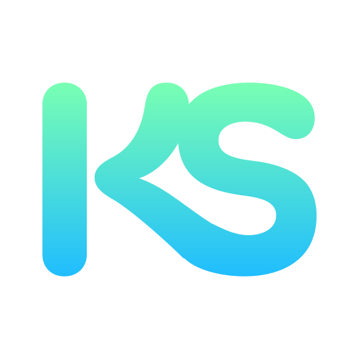

  <h1><b>Portfolio</b> website <u>for</u> <i>Karl Sellergren</i>.</h1>
  
This is the official repo for Karl Sellergrens portfolio website.

  
<b>REST API created with <a href="https://github.com/apollographql/apollo-client">Apollo GraphQL 🚀</a>, the used React Framework is <a href="https://github.com/vercel/next.js">Next.JS</a>, website structure is made possible by <a href="https://www.npmjs.com/package/bootstrap">Bootstrap 5</a>.</b>

   

## Live soon!
As soon as the project is ready for production, it will be up and running att [https://seller.green](https://seller.green).
  
## Want me to work with you?
Send me an email at [karl@seller.green](mailto:karl@seller.green), or check out my socials:

